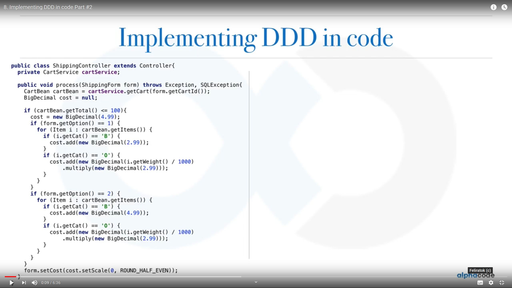

# DDD

## Ajánlott irodalom

* Implementing Domain-Driven Design
* [Alpha Code Channel](https://www.youtube.com/channel/UCmbnw2hZFf6JzWICZIPe9cg)

## Tematika

* Mikor és hol vágjunk?
* Top-down
* Ne tervezzünk meg mindent előre az utolsó részletig, evolutionary design
* OOP fogalmak fontossága
* Modellezés, modellalkotás
* DDD: modellezési eszközök, minták
* A legtöbb architektúrával használható: Event driven architecture, CQRS, Reactive and actor model, REST, SOA, microservices, cloud
* Rossz felépítés gyakori okai:
	* Az üzlet úgy tekint a szoftverfejlesztésre, mint költségre, és nem úgy, mint lehetőség, mint stratégiai komponens
	* Fejlesztők túl technológia közeliek
	* Túl nagy a jelentősége az adatbázisnak, és adatmodellnek, szemben a folyamatokkal
	* Fejlesztőknek a névadás nyűg, nem következetesek
	* Gyakran abból adódik, hogy nem értik meg az üzleti problémát, nem jó az interakció az üzlettel
	* Alapos tervezés nélküli, feature-ök folyamatos szállítása, Big Ball of Mud
	* Rétegek nem válnak szét kellően
	* Nem optimalizált, nem hatékony adatbázis lekérdezések, melyek blokkolják a normál folyamatokat
	* YAGNI, rossz absztrakciók
	* Túl szoros kapcsolat a komponensek között
* Strategic Design Tools (kontextusokban való gondolkodás) vs. Tactical Design Tools (kontextuson belüli komponensek)		
* Problem space:
	* Domain, felosztható subdomains: core domain, supporting domains, generic domains
* Solution space
	* Domain model (osztályok), Bounded context, Ubiquitous language (ugyanarra a fogalomra ugyanaz a szó)
		* Példa (client fogalma a sales, support, accounting és orders területen)
	* Domain expert: mental model
	* Saját db, saját API
	* Farmos példa
	* Context mapping: bounded contextek közötti kapcsolat
		* partnership: két csapat egy BC-n dolgozik
		* shared kernel: van egy közös rész, ami viszonylag stabil
		* customer-supplier: customer kér, supplier valamikor valamit ad
		* conformist: customer maximálisan igazodik ahhoz, amit a supplier ad
		*	Anticorruption layer: saját BC-re átforgatás a customer-en belül
		* Open host service: van egy jól használható API
		* Published language: XML séma, JSON séma, Protobuf, Avro
		* Separate ways: nincs integráció
	* Kommunikáció
		* SOAP
		* REST
		* Messaging
* Domain megértése
* Technológiamentes
* Tactical design tools
	* Implementációs részletek
	* BC - microservice - country hasonlat
	* Value objects (sohat BigDecimal, float for money): immutable, auto validation, domain logic, eq, thread safe
	* Entity: id, value objects és más entitásokkal kapcsolat, sor az adatbázisban, mutable
	* Aggregate
		* Túl bonyolult objektum gráf
		* Egy tranzakciónyi
		* Root entity - teljes életciklust vezérli
		* Mindig konzisztens állapotban van
	* Factory
		* Ha túl bonyolult az aggregate létrehozása
	* Repository
		* Abban különbözik a DAO-tól, hogy csak aggregate-enként van, nem entitásonként
		* Betölti a kapcsolatokat is
* Tervezés
	* UML, diagrammok, user story-k hatékonysága kérdőjeles
	* Event storming - brainstorming a domain model átadására
	* Eventekből indul ki
	* Sorrendbe tenni
	* Hozzákapcsolni a szerepköröket, commandokat
	* BC-k azonosítása
* Kód duplikáció, követhetőség, karbantartás igény

# Integrációs technológiák

## XML, SOAP

* Mire való a névtér?
* Mi az az XML séma? Vivel definiált az XML séma?
* Mire való az XPath? Milyen részekből áll? Hol használható?
* Milyen XML eszközöket ismersz?
* Mire való az XSLT?
* Java-ban milyen API-k vannak XML kezelésre? Mi része a standard Javanak? Milyen különbségek vannak köztük?
* Mi az az XML entity reference?
* Mi az az XML bomb?
* Mi az a CDATA?
* Mikor elem, mikor attribútum?
* Vannak-e elnevezési konvenciók?
* Hogyan tesztelsz XML feldolgozást?
* Milyen szabványokat ismert SOAP webszolgáltatásokra Java-ban? Milyen implementációkat?
* Kód- és sémagenerálás mennyire elfogadható?
* Hogyan akadáloyzzuk meg, hogy a teljes XML betöltésre kerüljön?
* SOAP/WSDL lehetővé teszi, hogy egymással kommunikálni tudjanak eltérő technológiák?

## HTTP, REST

* Mik azok a HTTP státuszkódok, melyek a gyakori státuszkódok?
* Mit hívunk RESTful webszolgáltatásoknak? Milyen tulajdonságai vannak?
* Vannak-e típusok a JSON-ben?
* A RESTful webszolgáltatások a HTTP milyen tulajdonságait használják ki?
* RESTful webszolgáltatásoknál mire valók a paraméterek?
* Milyen metódusokkal használjuk a create és update műveleteket?
* A CRUD műveleteknél milyen értékeket adjunk vissza?
* Mi az a `Content-Type` header és Mime-type
* Hogyan néz ki a http cache-elés? Mi az az ETag?
* Milyen megoldásokat ismersz arra, hogy szerver oldalról üzeneteket küldj?
* Mi az a STOMP?
* Mi az a HATEOAS?
* Mi az a CORS?
* Hogyan kezelsz hibákat? RFC 7807
* Van séma JSON-re?
* Van API leírás REST-re?
* Milyen szabványok és implementációk vannak REST implementálásra Java-ban?
* Milyen JSON library-k vannak Java-ban?
* Hogyan kezelsz API verziókat?
* Milyen teszt eszközöket ismersz?

### Említendő

* OpenAPI
* Postman
* Swagger

## JMS

* Mire való a fejléc?
* Ki lehet olvasni egy üzenetet a sorból, anélkül, hogy kivennénk?
* Mi az a mérgezett üzenet?
* Mi az a correlation id?
* Lehet küldeni és a választ fogadni egy tranzakcióban?
* Mi kell ahhoz, hogy egy tranzakcióban legyen a db írás és az üzenetküldés?
* Mi az a Temporary queue?
* Mire való a message selector?
* Mire való a Message Persistence?
* Hogyan állítható a prioritás?
* Garantálható sorrend az üzenetek között?
* Mi az a Message Expiration és Delivery Delay?
